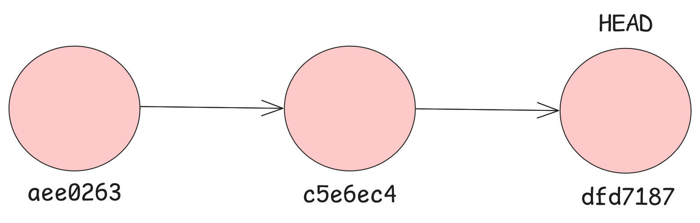
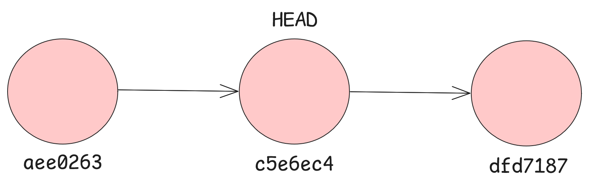

# CHAPTER 2 : OUR FIRST REPOSITORY
## First steps...
~~~sh
mkdir git-good
cd git-good
git init
~~~
You should get this output:
~~~sh
hint: Using 'master' as the name for the initial branch. This default branch name
hint: is subject to change. To configure the initial branch name to use in all
hint: of your new repositories, which will suppress this warning, call:
hint: 
hint:   git config --global init.defaultBranch <name>
hint: 
hint: Names commonly chosen instead of 'master' are 'main', 'trunk' and
hint: 'development'. The just-created branch can be renamed via this command:
hint: 
hint:   git branch -m <name>
Initialized empty Git repository in ../projects/git-good/.git/
~~~
We can verify that git is initialised in our folder by doing...
~~~sh
git status
~~~
...which should give us this output
~~~sh
On branch master

No commits yet

nothing to commit (create/copy files and use "git add" to track)
~~~

We will be discussing branch very soon. For now, think of it as a separate reality of your file.

`No commits yet` tells us that there are no files for Git to track yet, so let's create our first files for Git to track.

Let's create a file named `hello_world.py` and `README.md` from the command-line. 
~~~sh
ni hello_world.py
ni README.md
~~~
After this, we'll go back to the command-line and do `git status` again and we will see that we get a different output:
~~~sh
On branch master

No commits yet

Untracked files:
  (use "git add <file>..." to include in what will be committed)
        hello_world.py
        README.md

nothing added to commit but untracked files present (use "git add" to track)
~~~
This output tells us that we have a new file in our repository **but Git hasn't tracked.** To tell Git to track our file we do `git add`

What this does is that it *stages* our files. Staging is basically preparing our files for the **commit stage** which we will get into later.

**Staging** allows us to choose which files we want to track. This logic will click once we learn how to commit.
~~~sh
git add hello_world.py # this only tracks hello_world.py
# or
git add . # this adds all the files that are untracked
~~~

## Commit
A **commit** in Git is like taking a snapshot of your project at a specific point in time. When we commit, we are telling Git to save the **current state** of the files in the repository along with metadata such as the author, date, and a message describing the change.

When we commit, Git assigns our current state of the project to an address called a **hash** which is just a series of random numbers and letters forming a distinct address. *We will explore this a bit later*.

To commit a file, we simple use the `git commit` command. but one thing to take note of is that using `git commit` will take you to Git's default editor which is `vim`. You don't want to use `vim` yet, so instead we will be doing the `git command -m "message"` command.
~~~sh
git commit -m "My first commit"
~~~
There should be an output like:
~~~sh
[master (root-commit) aee0263] My first commit
 2 files changed, 5 insertions(+)
 create mode 100644 README.md
 create mode 100644 hello_world.py
~~~

### What is a commit message?
A commit message is a body of text summarising/describing what changes were made and their purposes. It could be that you are fixing an error, so you type
~~~sh
git commit -m "Fixed error"
~~~
or you were adding a new file/feature
~~~sh
git commit -m "Added new feature"
~~~

## Staging?
Remember when we talked about staging our files? Let's take another situtation.

Imaging you're working on two files: `bug_errors.py` and `new_app_features.py`. You have to fix the errors  before adding a new feature to the application. 

To do that, you only stage and commit the bug fix file, `bug_errors.py`
~~~sh
git add bug_errors.py
git commit -m "Fixed bugs in bug_errors.py"
~~~
Now your application is working again. After that, you can continue working on your new feature. Once you're ready, you stage and commit the feature file separately:
~~~sh
git add new_app_features.py
git commit -m "Added new features to app"
~~~
This is the purpose of the **staging**  area: it lets you control exactly which changes go into each commit.

## Git Log
There will be a lot of commits in a single project, you will eventually forget what sort of commits have been done to your project. So to aid that, Git has a command to check your history of commits which are `git log` and `git log --oneline`. 

What makes these two commands different? Not a lot. `git log` gives you an in-depth look into your history of commits, while `git log --oneline` gives you just enough information about your commits in one line, hence the name.

When you do `git log`, your output might look like this:
~~~sh
Author: Schubert <schubertschumann2@gmail.com>
Date:   Sun Nov 16 17:43:04 2025 +0800

    Added new features to app

commit c5e6ec48f4e5c23722a1ea1968a7a37c8e390cc7
Author: Schubert <schubertschumann2@gmail.com>
Date:   Sun Nov 16 17:42:48 2025 +0800

    fixed bugs in bug_errors.py

commit aee0263e62149a7edf607abf1e7dffef54c01562
Author: Schubert <schubertschumann2@gmail.com>
Date:   Sat Nov 15 02:40:43 2025 +0800

    My first commit
~~~

However, `git log --oneline` does this:
~~~sh
dfd7187 (HEAD -> master) Added new features to app
c5e6ec4 fixed bugs in bug_errors.py
aee0263 My first commit
~~~

### Hash Address
When we commit, we assign a unique identifier to this version of the repository and this identifier happens to be the hash address.

A hash address is a series of letters and numbers that point to a specific version of the project.

For example, the hash address pointing to our first version of the project is `aee0263e62149a7edf607abf1e7dffef54c01562`. However, we only need the first 7 characters. That is why in `git log --oneline` we only get the first 7 characters of the hash address. 

> Side note: Your hash addresses and mine will not be the same. Every hash address here will refer to mine but hopefully from there you can learn to use it on your own hash addresses.

But why does the hash address matter? The hash address matters for a lot of reasons, but only one reason you need to know. Hash address matters because it helps developers to trace their work. We will check out more commands that use the hash address in the future.

### Head and DETACHED head
~~~sh
dfd7187 (HEAD -> master) Added new features to app
c5e6ec4 fixed bugs in bug_errors.py
aee0263 My first commit
~~~
Notice in our `git log --oneline` there is this line `(HEAD -> master)`. Let's unpack what that means. 

#### Master
Master refers to the branch name. We will go into more detail about branches after this chapter.

#### Head
The head is a pointer that tells Git which version of the project you are currently looking at. Whenever you commit something new, Git automatically moves HEAD forward to that newest version.

#### Detached Head
Normally, head points to the **latest version** of the project you are working on. 

A head is "detached" when you tell Git to look at another version of the project **instead** of the latest.

But how do we move to another version of the project? 

We have a command called `git checkout` for that.

## Git Checkout
If you do `git checkout [insert hash address of commit]`, you will be able to "check out" a commit and "detach" the head:

~~~sh
git checkout c5e6ec4
~~~

You should get an output like this:
~~~sh
Note: switching to 'c5e6ec4'.

You are in 'detached HEAD' state. You can look around, make experimental
changes and commit them, and you can discard any commits you make in this
state without impacting any branches by switching back to a branch.

If you want to create a new branch to retain commits you create, you may
do so (now or later) by using -c with the switch command. Example:

  git switch -c <new-branch-name>

Or undo this operation with:

  git switch -

Turn off this advice by setting config variable advice.detachedHead to false

HEAD is now at c5e6ec4 fixed bugs in bug_errors.py
~~~

To go back to your latest commit, you simply have to do `git checkout branch_name` and in this case, branch_name is master. Again, we will learn what is a branch in future lessons.