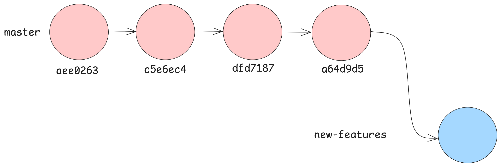
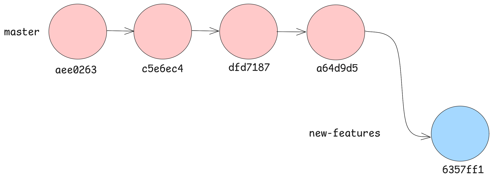
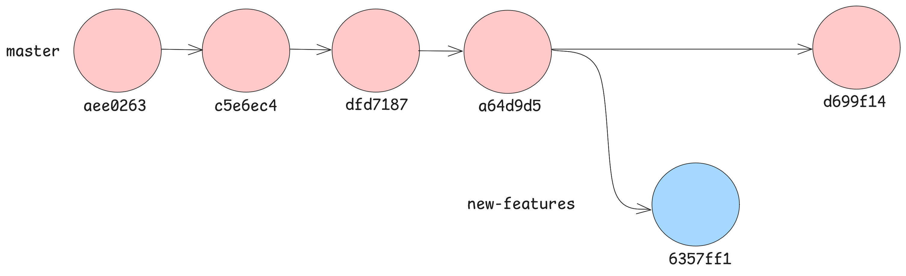
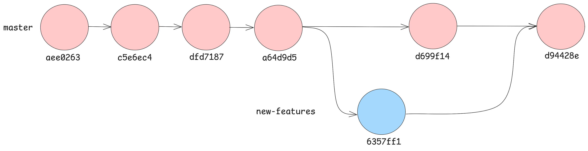

# CHAPTER 3: BRANCHING & MERGING
Imagine this: 

You are building an app. You've already finished the basic version and everything is working perfectly. This is your **stable** version — the one you don't want to mess up. You stage and commit your stable version. 

Now, you want to add new features to your app.

**BUT** there are some problems that need solutions.

- What if your new features break your app?
- What if you want to experiment?
- What if your code stops working halfway through?
- What if you want to go back to the stable version to test something?

Is there a way for you to experiment on your app without having to affect your stable version?

The answer is **Yes**, let me introduce you to branching & merging.

## Branching
A branch is a separate workspace where you can make changes and try new ideas without affecting the main project. Think of it as a "parallel universe" for your code. 

### Before we demonstrate...
For clarity in our branching process, let's delete files `bug_errors.py` and `new_app_features.py`.

You should get this output when you do `git status`
~~~sh
On branch master
Changes not staged for commit:
  (use "git add/rm <file>..." to update what will be committed)
  (use "git restore <file>..." to discard changes in working directory)
        deleted:    bug_errors.py
        deleted:    new_app_features.py

no changes added to commit (use "git add" and/or "git commit -a")
~~~
We will stage this and commit this, so do `git add .` and then `git commit -m "delete bug_errors.py and new_app_features.py"`.

### Continuing on our branching adventure...
Let's make sure we are clear about where we are before we branch out, so let's do `git log --oneline`. We should get this output:
~~~sh
a64d9d5 (HEAD -> master) delete bug_errors.py and new_app_features.py
dfd7187 Added new features to app
c5e6ec4 fixed bugs in bug_errors.py
aee0263 My first commit
~~~

Great, our **HEAD** is pointing to the latest commit on the `master` branch. This is important because if it is a **detached HEAD**, creating a branch would mean we will branch out of that detached HEAD.

To create a branch named `new-features`, you use the git command `git branch new-features`. We can verify that we have added this branch by doing `git branch -a` or `git branch --all`

You should get an output like this when you list your branches:
~~~sh
* master
  new-features
~~~

What this tells us is that we are on our master branch, but we have another branch named `new-features`

To move to this branch, we can do:
~~~sh
git checkout new-features
~~~

Now if you do `git branch -a` again, you will get:
~~~sh
  master
* new-features
~~~
with the asterisk * pointing to new-features.
> `git checkout new-features` can also be done before creating the `new-features` branch as the command will just create the branch for you and instantly move you there.

In this version let's add a file called `webpage_features.py`, and then we do our stage and commit routine.

~~~sh
git add webpage_features.py
git commit -m "Added webpage features to app"
~~~

When you do `git log --oneline`, you should have this output:
~~~sh
6357ff1 (HEAD -> new-features) Added webpage features to app
a64d9d5 (master) delete bug_errors.py and new_app_features.py
dfd7187 Added new features to app
c5e6ec4 fixed bugs in bug_errors.py
aee0263 My first commit
~~~

What this tells us is that our master branch is still on `a64d9d5`. Remember, we branched out from that commit, so we our **HEAD** is on our `new-features` branch.

Now, our project looks like this.

**Awesome**, you have just committed your first file in a new branch. Let's say you're done with the new features for a while, and let's work on some minor tweaks in the stable version of your app.

Say you need to write your `README.md` so that users can understand how to use your app.

Let's go back into our master branch by doing.
~~~sh
git checkout master
~~~
We should always verify by doing `git log --oneline`
~~~sh
a64d9d5 (HEAD -> master) delete bug_errors.py and new_app_features.py
dfd7187 Added new features to app
c5e6ec4 fixed bugs in bug_errors.py
aee0263 My first commit
~~~

Great, our HEAD is at our master branch. So now, let's type this into our `README.md`
~~~md
# Random App for specific problem
## Requirements:
-
-
-

## How to install:
1.
2.
3.
~~~

Then we can stage and commit.
~~~sh
git add README.md
git commit -m "update README.md"
~~~

When doing `git log --oneline`, we should get:
~~~sh
d699f14 (HEAD -> master) update README.md
a64d9d5 delete bug_errors.py and new_app_features.py
dfd7187 Added new features to app
c5e6ec4 fixed bugs in bug_errors.py
aee0263 My first commit
~~~

Visually, this is how our graph looks like now.

Wonderful. The beauty of Git lies before your very eyes.

## Merging
So far, we have

- [x] Updated our README.md on the master branch
- [x] Create a new branch called `new-features` and committed a feature file `webpage_features.py` on the branch

Let's say, upper management is satisfied with our feature and wants us to integrate the new features into our app.

It's time to `merge` the branches.

### What is merging?
Merging is simply asking Git to combine the changes from one branch into another.

But before we `merge`, We need to checkout to the branch that we want to `merge` into (often `main` or `master`).

Let's check what branch we are on right now.
~~~sh
  master
* new-features
~~~
Since we are on the `new-features` branch, let's `git checkout master`
~~~sh
git checkout master
~~~

And then only can we merge. The command for this is `git merge -m "message"`

~~~sh
git merge new-features -m "Merge branch 'new-features'"
~~~

Now let's do `git log --oneline` and see what's happening:
~~~sh
d94428e (HEAD -> master) Merge branch 'new-features'
d699f14 update README.md
6357ff1 (new-features) Added webpage features to app
a64d9d5 delete bug_errors.py and new_app_features.py
dfd7187 Added new features to app
c5e6ec4 fixed bugs in bug_errors.py
aee0263 My first commit
~~~

Visually:

